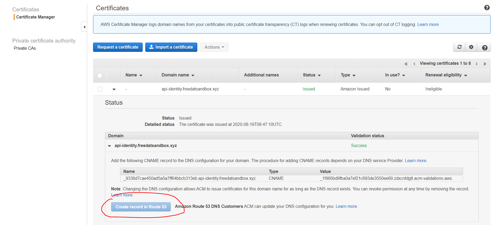

# Introduction 


 • [Website](https://www.bcx.co.za/exa/) • [Docs](docs/architecture/architecture.svg)

This is opinionated boilerplate code that aims to meet the requirements set out by our technical architecture team.

- [x] 1. Independently Maintainable
- [x] 2. Independently Testable
- [x] 3. Independently Deployable
- [x] 4. Starter Pack
- [X] 5. Local Debugging
- [x] 6. Portable
- [x] 7. Traceable
- [x] 8. Documented
- [x] 9. Cost Effective 
- [ ] 10. CICD
- [ ] 11. Audit

---
# Quick Start 


### Install IDE, Nodejs & AWS CLI

1. Install VSCode: https://code.visualstudio.com/download
2. Install Nodejs: https://nodejs.org/en/download/
3. Install AWS CLI: https://awscli.amazonaws.com/AWSCLIV2.msi.
4. Fork or clone the repo

---
### Initial Setup
---
1. Install Serverless globally
```bash
npm install -g serverless
```
2. Configure your serverless to use the correct AWS profile
```bash
serverless config credentials --provider aws --key <YOURKEY> --secret <YOURSECRET> --profile <PROFILENAME>
```
3. Install all packages
```bash
npm install
```
4. Configure your .env files with the appropriate settings. Situation in environments folder

```bash
PORT=<PORT>
STAGE=<STAGE>
NODE_ENV=<NODE ENV>
DOMAIN_NAME=<DOMAIN NAME>
APP_NAME=<APP NAME>
REGION=<YOUR REGION>
```

5. Add a .env.local file to environments folder to store your secrets. This file won't be added to your repo.

```bash
ACCESS_KEY_ID=<ACCESS_KEY_ID>
SECRET_KEY=<SECRET_KEY>
AWS_PROFILE=<PROFILE_NAME>
HOSTED_ZONE_ID=<HOSTED ZONE ID>
```
> Coffee for the team if you add your secrets to the public repo.
---  
## For Local Development
---
 - Uses node and nodemon (Rapid Development)
```bash
npm run dev 
```
 - Uses serverless offline (AWS Simulate)
```bash
npm run offline 
```
---
## For Dev/UAT/Prod Deployments
---
### Pre-Requisites & Notes
---
- You need a domain registed using Route53 in the same AWS account for this to work. In the background, we are creating a certificate used by the API Gateway.  Check out [this](https://docs.aws.amazon.com/AWSCloudFormation/latest/UserGuide/aws-resource-certificatemanager-certificate.html)  link for more info.
- We recommend using subdomains for each micro-service you create. api.yourdomain.co.za appose to yourdomain.co.za/api.  This is to keep your certificates and domains isolated for each micro-service.


```bash
npm run deploy:dev
npm run deploy:uat
npm run deploy:prod
```
## Tips & Tricks

> Note: Lambda cold start plays a role in showing the initial load of swagger ui interface.  

> Tip: Initial deployments can take up to 40 min. This because certificates needs to be validated and DNS needs to propogate. You can fast track the deployment by logging in the console and creating the DNS records manually.


# Details Explanations

## Requirements Mapping Table

| Technical Component | Business Requirement       |
| ------------------- | -------------------------- |
| Serverless          | Independantly Deployable   |
| Serverless Offline  | Local Debugging            |
| Nodemon             | Local Debugging (Rapid)    |
| TSOA                | Documented                 |
| Swagger-UI          | Documented                 |
| X-Ray               | Traceable                  |
| Express             | Portable                   |
| Typescript          | Independantly Maintainable |
| Eslint              | Independantly Maintainable |
| Jest                | Independantly Testable     |

---
## Available Deployment Environments
The project has the ability to deploy on.

- AWS (API Gateway, Lambda, ACM & Route53) - Full Featured
- Docker Container running Node.js - No Auto Domain Setup 
- Linux Server/Windows Server running Node.js - No Auto Domain Setup

See the architecture below


You can modify the architecture.drawio file inside the docs file should you wish to do so.

# Recommended VSCode Extensions

- I found [this](https://marketplace.visualstudio.com/items?itemName=hediet.vscode-drawio) vscode extension to be useful as it allows you to draw and view draw.io files inside the editor.  
- Also, [this](https://marketplace.visualstudio.com/items?itemName=yzhang.markdown-all-in-one) markdown extention is also pretty cool.  Once installed, press ctrl-shift-v to view the markdown file.

# To-Do's & Bugs

- Test out buildspec
- Write unit tests
- Create codebuild serverless file

# Change Log

- 1.0.0 

The initial working template

- 2.0.0

Changed how underlying env variables work. One set of env variables both iac components & app

# Contributions

- Serverless team
- Cloudformation team
- Typescript 
- BCX Team
